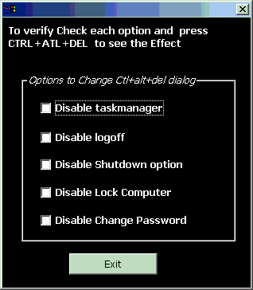



## disable task Manager and many more

### Description

This Code will Explore the Secrets of Windows Registry . I hope this Program will help You in the Situation where you have to restrict user from following operations:

1) Kill a process by task manager, (where your application is a spy program)

2) Change password

3) Lock the Console

4) Shutting the Down the Machine ( if it is a Server)

5) log off .

Please Vote or Comment me!!! (what ever you like)

The Program is Tested on windows NT and Windows 2000.

To test the Program on windows NT and windows 2000, after Selecting Each Checkbox Press CTRL+ALT+DEL and you will see the selected option will be disabled

Enjoy
 
### More Info
 

             |
---                |---
**Submitted On**   |2002-03-12 16:01:58
**By**             |[joyprakash saikia](https://github.com/Planet-Source-Code/PSCIndex/blob/master/ByAuthor/joyprakash-saikia.md)
**Level**          |Advanced
**User Rating**    |4.8 (181 globes from 38 users)
**Compatibility**  |VB 5\.0, VB 6\.0
**Category**       |[Registry](https://github.com/Planet-Source-Code/PSCIndex/blob/master/ByCategory/registry__1-36.md)
**World**          |[Visual Basic](https://github.com/Planet-Source-Code/PSCIndex/blob/master/ByWorld/visual-basic.md)
**Archive File**   |[diable\_tas615413122002\.zip](https://github.com/Planet-Source-Code/joyprakash-saikia-disable-task-manager-and-many-more__1-32612/archive/master.zip)

